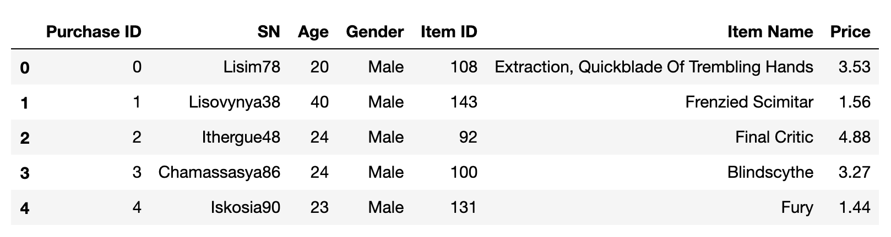
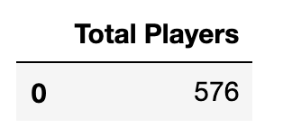
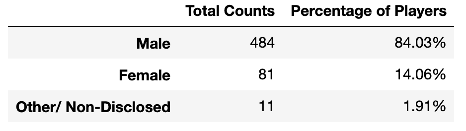
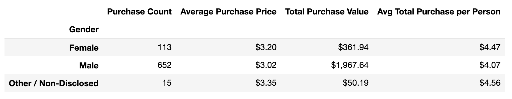
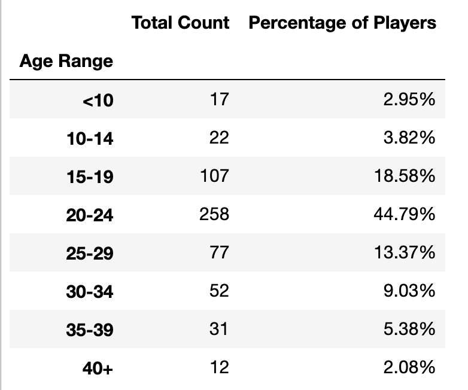
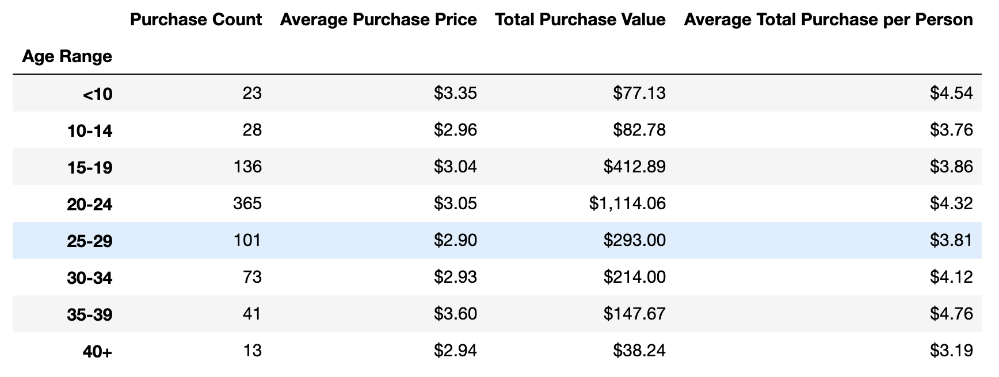
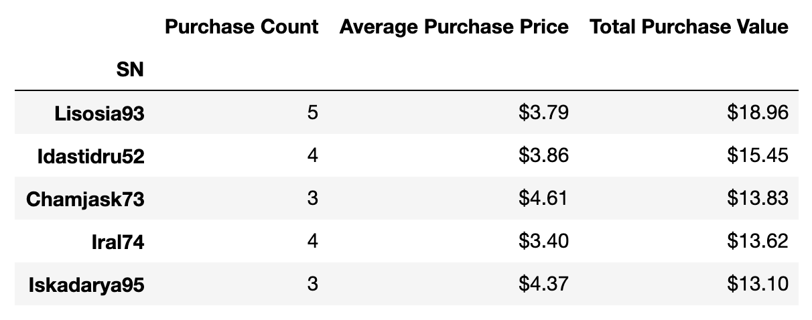
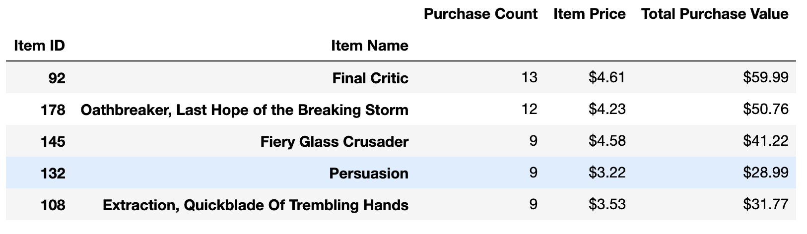
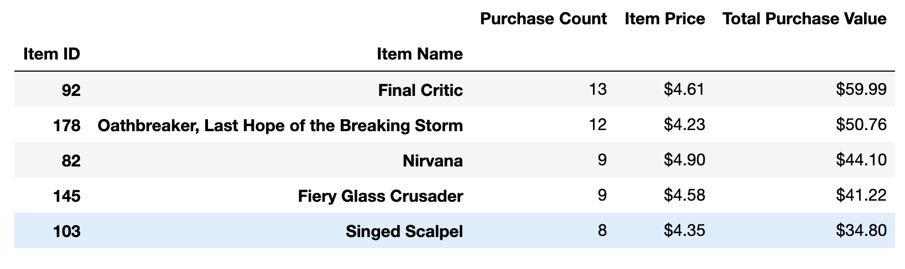

# Pandas_Challenge

## Data Source 

purchase_data.csv

## Output

Using the purchase_data, I was able to find the following items and throw them into different DataFrames.

### DataFrame

### Total Number of Players

### Purchasing Analysis DataFrame

### Gender Demographics

### Puchasing Analysis by Gender

### Age Demographics

### Purchasing Analysis by Age

### Top Spenders

### Most Popular Items

### Most Profitable Items

